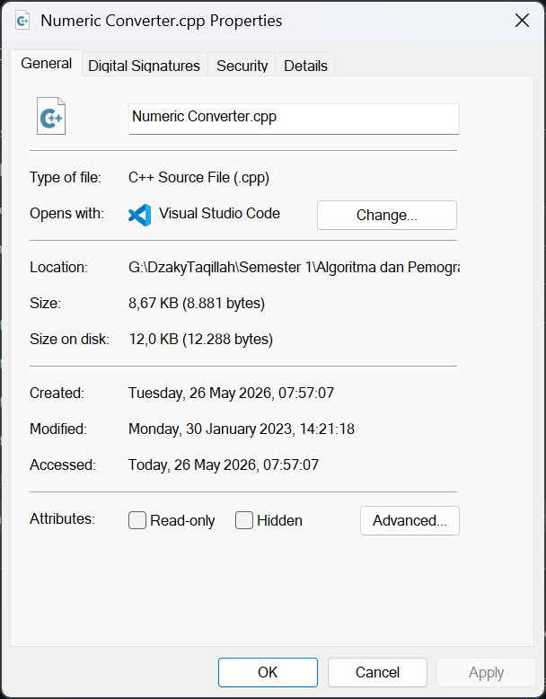
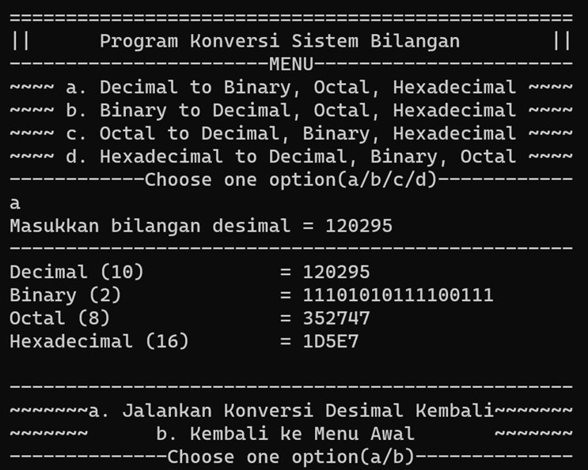

# Numeric Converter - My First Functional Code

Ini adalah kode fungsional yang pertama kali saya pernah buat. Kode ini dibuat dengan menggunakan bahasa C++ untuk melakukan konversi bilangan desimal, biner, oktal, dan heksadesimal. Kode ini dibuat untuk memenuhi tugas dari mata kuliah Algoritma dan Pemrograman yang saya dapatkan saat semester 1 pada awal tahun 2023.

## Pengembangan

Pada saat pertama kali membuatnya, saya belum mempelajari konsep pemrograman berorientasi objek (OOP), sehingga saya menuliskan kode yang sama berulang kali. Beberapa bulan setelahnya, saya mencoba untuk membuat ulang dengan menerapkan konsep OOP.

## Hasil

